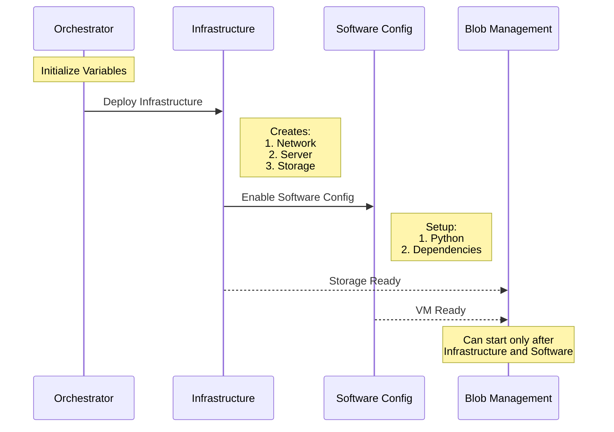
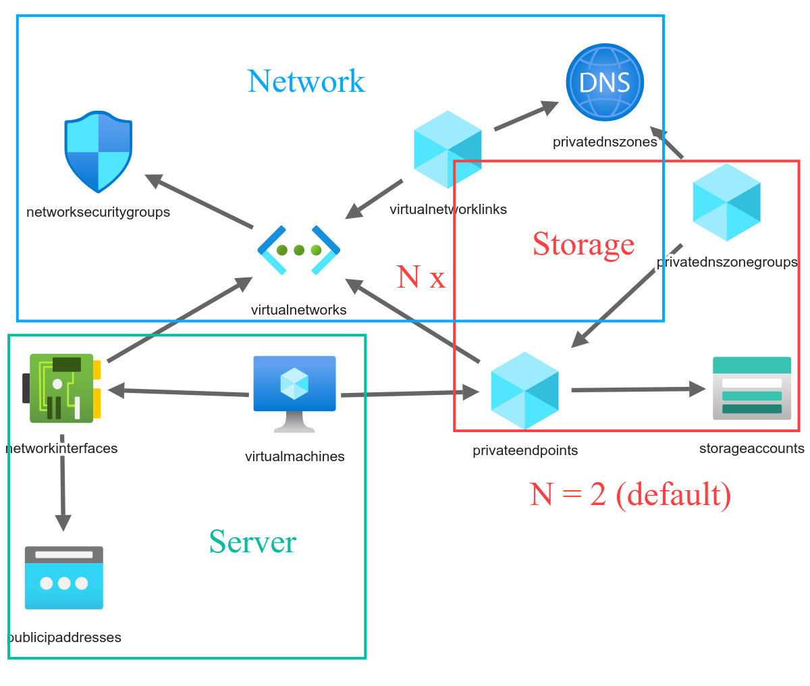

# Azure Infrastructure as Code Project

This repository implements an Azure infrastructure deployment solution using Infrastructure as Code (IaC) principles. It provides a complete CI/CD pipeline for deploying and managing Azure resources through Azure DevOps.

## Features

- **Infrastructure Deployment**: Automated deployment of network, compute, and storage resources
- **VM Configuration**: Automated software installation and configuration
- **Blob Management**: ETL operations across storage accounts
- **Pipeline Orchestration**: Coordinated execution of deployment stages

## Architecture

### Pipeline Flow
[Pipelines documentation](docs/architecture/pipeline-documentation.md)



### Infrastructure



## Terminology

Please note that the word "subproject" in this file specifically and in this repository generally refers to the specific mini-project hosted in your "project". The term "project" refers to `ProjectName` as can be found here: `https://dev.azure.com/<organizationName>/<ProjectName>`

## Repository Contents

- **infrastructure/templates/arm/**: ARM templates for deploying Azure resources such as networks, servers, and storage.
- **pipelines/**: Pipeline files for continuous deployment and blob management.
  - **blob_management.yml**: Pipeline for managing Azure Blob Storage.
  - **infrastructure_deployment.yml**: Pipeline for full infrastructure setup.
  - **pipeline_orchestrator.yml**: Pipeline for orchestrating the execution of multiple pipelines.
  - **vm_software_configuration.yml**: Pipeline for configuring software on VMs.
- **scripts/**: Utility scripts for resource deployment and blob management.
- **scripts/setup_tools/**: Helper scripts for automating setup tasks like creating resources and packaging files. Currently not relevant to the working part of the project. (Watch the [TODO file](TODO.md) file for more info)
- **monitoring/templates/**: Templates for configuration of monitoring metrics.
- **docs/**: Documentation and guides
  - **architecture/**: System design and architecture documentation
    - **pipeline-documentation.md**: Detailed pipeline workflow documentation
    - **project_design_decisions.md**: Key architectural decisions and rationale
    - **infrastructure_topology_picture.png**: Infrastructure diagram
  - **guides/**: Setup and configuration guides
    - **azure_devops_self_hosted_agent_setup.md**: Self-hosted agent setup guide
    - **create_azure_service_connection.md**: Service connection setup guide
- **README.md**: This document.
- **LICENSE**: License information.
- **requirements.txt**: Python dependencies required for the project.

## Project Prerequisites

- Azure subscription.
- Ensure you have the Azure CLI installed and configured on your agent machine.
- Ensure you have Bash and PowerShell installed.
- Ensure you have an Azure DevOps account.
- Ensure you have a working Azure DevOps agent available (See [Setup azure devops self hosted agent](docs/guides/azure_devops_self_hosted_agent_setup.md)).

## Instructions

1. [Optional] Fork this (remote) repository.
2. Enter Azure DevOps.
3. Create an Azure service connection (See [Create azure service connection](docs/guides/create_azure_service_connection.md)).
4. Create a variable group named **VG-<project\>-<environment\>-<location\>** (in Azure DevOps->Pipelines->Library) and add the following variables:
   - **subproject**: Sub-project name.
   - **organizationUrl**: Organization URL. (`https://dev.azure.com/<Organization Name>`)
   - **project**: Project Name. (`https://dev.azure.com/<organizationName>/<ProjectName>`)
   - **environment**: dev/prod/test, etc.
   - **location**: Specifies the geographical location where resources will be created. To view the list of available locations, run the following command in the Azure CLI:
     ```bash
     az account list-locations -o table
     ```
   - **owner**: Person/team responsible for the resources.
   - **adminUsername**: Admin username for VM.
   - **adminPassword**: Admin password for VM (set securely). The supplied password must be between 6-72 characters long and must satisfy at least 3 of the following password complexity requirements:
     - Contains an uppercase character.
     - Contains a lowercase character.
     - Contains a numeric digit.
     - Contains a special character.
     - Control characters are not allowed.
5. Create the following pipelines:
   - **pipeline_orchestrator.yml** - Name it `Orchestrate-Pipelines`.
   - **infrastructure_deployment.yml** - Name it `Infrastructure-Deployment`.
   - **blob_management.yml** - Name it `Manage-Blobs`.
   - **vm_software_configuration.yml** - Name it `Configure-VM-Software`.

### Permissions

Ensure the pipelines have permissions for the following:
1. **Azure Service Connection**: If you restricted Azure service connection pipeline permission, grant these pipelines permission (See manuals/create_azure_service_connection.md -> Restrict Pipeline Access).
2. **Pipelines Permissions to the Variable Group you Created**: 
   1. Pipelines->Library->Pipeline permissions.
   2. Pipelines->Library->Security-> <ProjectName\> Build Service - Give it Creator Role
      - The <Project\>/Build Service in Azure DevOps refers to the build service identity associated with your project. It is an automatically created service account that Azure DevOps uses to perform tasks like running pipelines, deploying resources, and accessing external systems during the execution of pipelines.
      - The build service account on which you can manage permissions will only be created after you run the pipeline once. Make sure that you already ran the pipeline once.
      - Alternatively, instead of modifying its role for the entire library, you can access Pipelines-> Library-> <Your created Variable Group\> -> Security-> <ProjectName\> Build Service - Give it Creator Role.

## Technical Notes

- **ResourceGroupName** value will be as follows:  `<subproject>-<environment>-<location>`.
- Tags of `<subproject>,<environment>,<location>,<owner>` will be added to the resource group created.
- The variable group you created will be updated with new key-value pairs during the Infrastructure-Deployment pipeline.

### Key Design Decisions

- **Network Architecture**: Implements a hybrid approach allowing secure internal communication while enabling controlled external access
- **Resource Naming**: Follows a standardized naming convention for improved resource management
- **Pipeline Structure**: Uses a modular approach with separate pipelines for infrastructure, configuration, and data management

For detailed rationale behind these decisions, see [Project Design Decisions](docs/architecture/project_design_decisions.md)

### Known Limitations

- Currently supports single-region deployments only
- Requires manual setup of initial Azure DevOps agent
- Password-based authentication used for VM access (key-based authentication planned)

## Deployment Best Practices

1. **Pre-deployment**
   - Validate all variable values before pipeline execution
   - Ensure service principal has required permissions
   - Review network security group rules

2. **During Deployment**
   - Monitor pipeline logs for potential issues
   - Verify resource creation in Azure Portal
   - Check metric collection is working

3. **Post-deployment**
   - Validate all resources are properly tagged
   - Verify network connectivity
   - Test blob storage operations
   - Check monitoring dashboards

### Debugging ARM Files Locally

Useful way to debug ARM files locally is by using the following command:

```bash
az deployment group validate --resource-group <resource-group> --template-file <template-file> --parameters <parameters-file>
```

## Monitoring

Azure Monitor workbooks are provided for comprehensive resource monitoring. These workbooks can be created manually using the provided templates and scripts.

### Workbook Creation
- Use the `create_workbook.sh` script to deploy workbook templates
- Located in `scripts/create_workbook.sh`
- Supports customizable workbook names and resource targeting

### Server Monitoring
Key metrics tracked via `monitoring/templates/server.json`:
- CPU Utilization (%)
- Memory Availability (GB)
- Disk Read Operations/sec
- Disk Write Operations/sec

### Storage Monitoring  
Key metrics tracked via `monitoring/templates/storage.json`:
- Transactions (Count)
- Egress (Bytes)
- Ingress (Bytes) 
- Availability (%)

The workbooks provide interactive dashboards for visualizing these metrics in Azure Monitor. Metrics can be customized and thresholds adjusted as needed.

## Troubleshooting

Common issues and solutions:

1. **Pipeline Permission Errors**
   - Verify service connection permissions
   - Check variable group access rights
   - Ensure agent has required access

2. **Resource Deployment Failures**
   - Validate ARM template syntax
   - Check resource naming conflicts
   - Verify resource quotas

3. **VM Configuration Issues**
   - Check VM network connectivity
   - Verify Python environment setup
   - Review script execution logs

## Support

For issues and questions:
1. Check the [TODO](TODO.md) file for known issues
2. Review pipeline logs for detailed error messages
3. Consult Azure documentation for service-specific issues

## License

Refer to the LICENSE file for details.

## Author

liorbenh