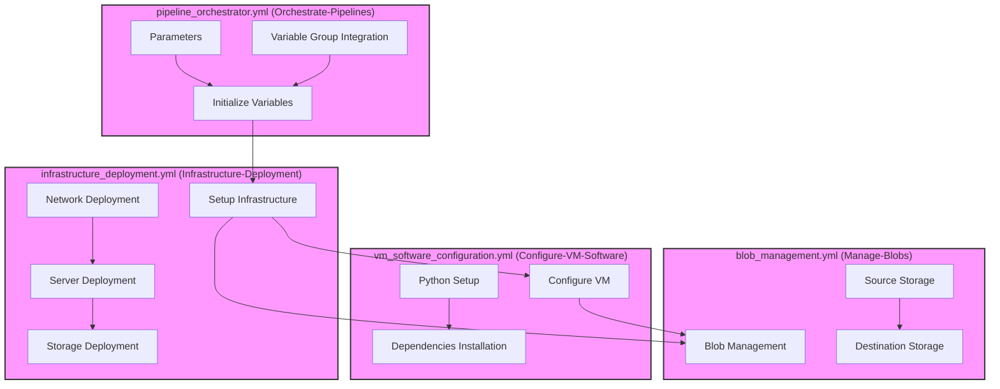
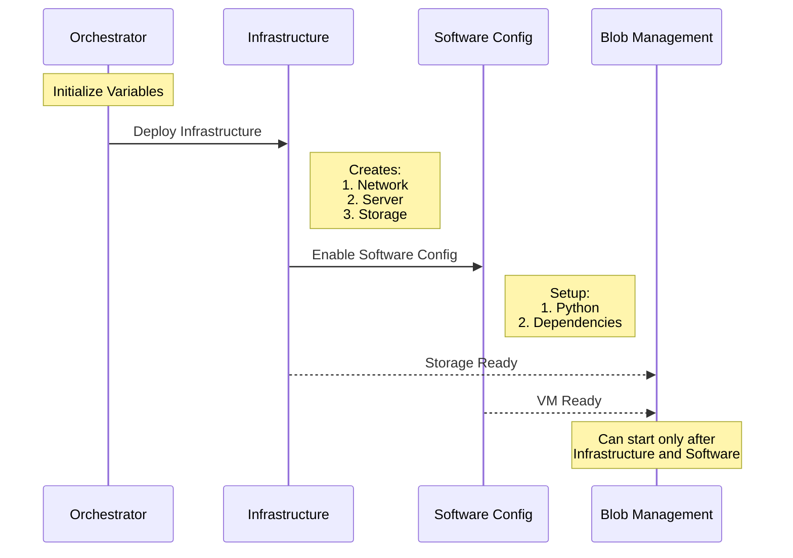

# Azure DevOps Pipeline Documentation

## Pipeline Architecture Overview

The following diagram illustrates the complete workflow and dependencies between pipelines:

## Pipeline Descriptions

### 1. Orchestrate-Pipelines (pipeline_orchestrator.yml)
**Purpose**: Master pipeline for coordinating all deployments

**Key Features**:
- Initialization of runtime variables
- Conditional execution of dependent pipelines
- Variable group management

**Parameters**:
- `activeVariableGroupName`: Target variable group
- `InfrastructureDeploymentEnabled`: Toggle infrastructure deployment
- `VMSoftwareConfigurationEnabled`: Toggle VM configuration
- `blobManagementEnabled`: Toggle blob management
- `debug`: Enable debug mode

**Jobs**:
1. Initialize Variables
2. Infrastructure Deployment (conditional)
3. VM Software Configuration (conditional)
4. Blob Management (conditional)

### 2. Infrastructure-Deployment (infrastructure_deployment.yml)
**Purpose**: Deploys core Azure infrastructure

**Key Components**:
- Network resources deployment
- Server provisioning
- Storage account setup
- Resource group management

**Deployment Sequence**:
1. Azure CLI installation & setup
2. Resource group creation with tags
3. Network deployment
4. Server deployment
5. Storage accounts deployment
6. Variable group updates

**Important Variables**:
- Resource group naming: `<subproject>-<environment>-<location>`
- Storage account configuration
- VM credentials management

### 3. Configure-VM-Software (vm_software_configuration.yml)
**Purpose**: Manages VM software installation and configuration

**Key Features**:
- Python environment setup
- Dependencies installation
- VM name management
- SCP file transfer support

**Parameters**:
- VM name handling (default/custom)
- Debug mode
- Service connection configuration

### 4. Blob-Management (blob_management.yml)
**Purpose**: Handles blob storage operations

**Key Features**:
- Multiple storage account support
- Container management
- Upload/download operations
- VM integration for blob operations

**Parameters**:
- Source/destination storage accounts
- Container name
- Upload flag
- VM name configuration

## Pipeline Dependencies

## Usage Guidelines

### First-Time Setup
1. **Variable Group Creation**:
   - Name format: `VG-<project>-<environment>-<location>`
   - Required variables:
     - subproject
     - organizationUrl
     - project
     - environment
     - location
     - owner
     - adminUsername
     - adminPassword

2. **Pipeline Creation Order**:
   1. Create infrastructure deployment pipeline
   2. Setup variable group permissions
   3. Create remaining pipelines

### Operational Guidelines
1. **Full Deployment**:
   - Use Orchestrate-Pipelines with all toggles enabled
   - Ensures proper dependency handling

2. **Partial Deployment**:
   - Use specific pipeline parameters to control execution
   - Verify dependencies are met

3. **Blob Management Operations**:
   - Requires successful infrastructure and VM configuration
   - Can specify custom storage accounts or use defaults

### Security Notes
- Ensure proper Azure service connection permissions
- VM credentials are managed through variable group
- Storage account access is controlled via private endpoints
